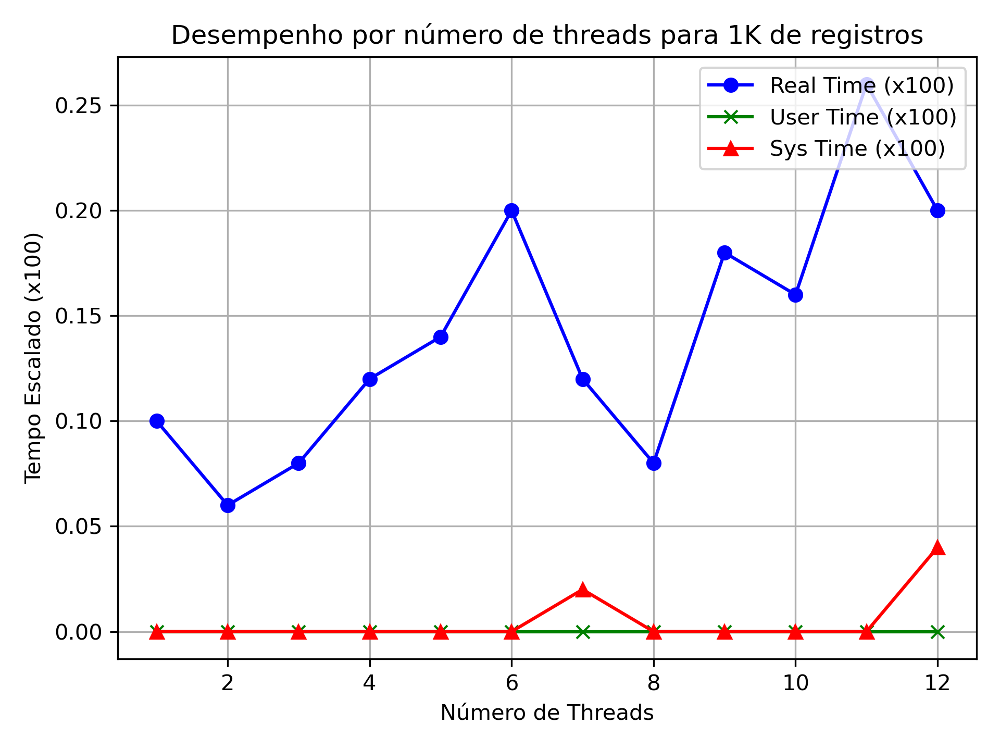

# Benchmarks dos protótipos
1) O código lê arquivos com registros de 100 bytes, sendo que cada registro possui 4 bytes para chaves e 96 bytes para dados. Mapea-os na memória, ordena utilizando Multithreaded, e por fim, escreve em um arquivo de saída
2) Será usado como base um script que executa o código 50 vezes por quantidade de Threads de maneira iterativa, para que seja possível obter uma média dos tempos e compará-los no final.
3) As chaves dos vetores foram sorteadas de maneira aleatória

# Benchmarks do projeto

Figura 1: Gráfico do tempo médio para 1 mil registros

Figura 2: Gráfico do tempo médio para 10 mil registros

Figura 3: Gráfico do tempo médio para 100 mil registros

Figura 4: Gráfico do tempo médio para 1 milhão de registros